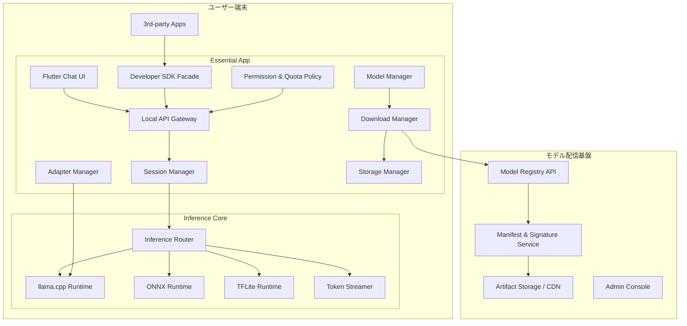

# Essential アーキテクチャ概要

## 目的

`Essential` は Android / iOS 上でオンデバイス AI モデルを実行し、以下の 2 つの価値を同時に提供するプラットフォームである。

- エンドユーザー向けのオフライン対応チャットアプリ
- 他アプリからローカル API / SDK 経由で利用できる AI ランタイム

モデルはアプリ本体に同梱せず、インストール後にユーザーが選択してダウンロードする。ベースモデルは共有管理し、アプリごとの adapter / LoRA を追加適用できる構成とする。

## 設計方針

- UI / アプリ基盤は Flutter を採用する
- LLM 推論は `llama.cpp` 系ランタイムを中心に据える
- 補助モデルは ONNX Runtime / TensorFlow Lite を用途別採用する
- Android と iOS は共通プロトコルを共有しつつ、IPC 実装は OS 制約に合わせて分離する
- モデル配信基盤は既存サーバー環境を壊さない独立プレーンとして追加する

## 全体構成



## サブシステム一覧

- `01_stack_decision.md`: 技術スタック選定
- `02_runtime_architecture.md`: 端末内ランタイム構成
- `03_model_management.md`: モデル / adapter 管理
- `04_ipc_and_sdk.md`: ローカル API / SDK 設計
- `05_adapter_strategy.md`: アプリ別 LoRA / adapter 戦略
- `06_chat_ui.md`: チャット UI / UX コンセプト
- `07_server_architecture.md`: モデル配信サーバー設計
- `08_risks.md`: リスクと対策
- `09_delivery_phases.md`: 開発フェーズ分割

## 推奨ディレクトリ構成

```text
Essential/
  apps/
    essential_flutter/
      lib/
        app/
        features/
          chat/
          model_management/
          developer_console/
          settings/
        shared/
      ios/
      android/
  packages/
    essential_sdk_dart/
    essential_protocol/
    essential_ui_kit/
  native/
    inference_core/
      include/
      src/
      bridges/
        android/
        ios/
    runtimes/
      llama/
      onnx/
      tflite/
    model_manager/
    adapter_manager/
    storage_manager/
  platform/
    android_service/
      aidl/
      kotlin/
    ios_framework/
      EssentialKit/
      AppGroupSupport/
  server/
    registry_api/
    manifest_signer/
    admin_console/
    infra/
  docs/
    architecture/
```