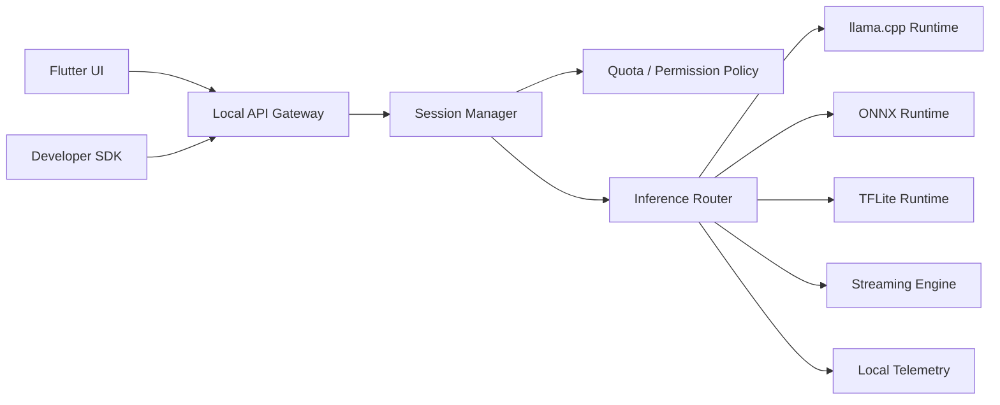

# ランタイムアーキテクチャ

## 目的

端末内で AI 推論を安定実行しつつ、UI と他アプリ連携の双方へ同じ推論基盤を提供する。

## レイヤ構成



## コンポーネント責務

### Local API Gateway

- UI と SDK の単一入口
- リクエスト検証
- 認可ポリシー適用
- セッション生成
- ストリーム配信制御

### Session Manager

- リクエスト単位のライフサイクル管理
- `request_id` 発行
- キャンセル管理
- セッションと adapter の紐付け

### Inference Router

- モデル種別ごとのランタイム選択
- デバイス能力に基づく実行ポリシー適用
- フォールバック戦略制御

### Streaming Engine

- トークン逐次配信
- partial chunk の整列
- completion と cancel の通知

## 実行モデル

### 内部標準プロトコル

```text
InferenceRequest
- request_id
- task_type
- model_requirement
- adapter_requirement
- messages / input
- generation_params
- stream
- timeout_ms
- caller_context
```

```text
InferenceResponse
- request_id
- status
- model_used
- adapter_used
- chunks
- token_usage
- latency_ms
- finish_reason
- error
```

## OS 別実装方針

### Android

- Bound Service を中核にする
- UI と他アプリからのアクセスを同一ゲートウェイへ集約する
- 長時間推論は必要に応じて Foreground Service 条件へ昇格する

### iOS

- 永続常駐サービスではなく、アプリ内 Framework と App Group 共有を主軸にする
- SDK 呼び出しを通じて同一ランタイムを使用する
- OS 制約に合わせてタスク寿命を短く保つ

## リソース制御

- 同時実行セッション数制限
- モデルロード上限制御
- バックグラウンド移行時の安全停止
- 端末 RAM とバッテリー状態に応じた品質調整

## フォールバックポリシー

- 高性能モデル要求時に端末要件不足なら軽量 variant を提示
- GPU 不可時は CPU fallback
- adapter 互換性不一致時は base model のみで続行可否を返す