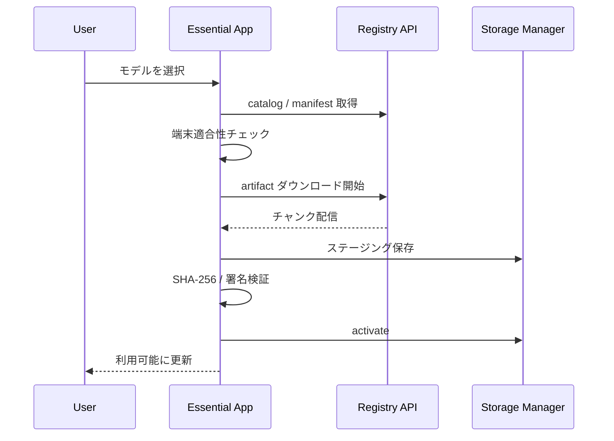

# モデル管理設計

## 基本方針

- モデルはアプリに同梱しない
- ユーザーがインストール後に一覧から選択してダウンロードする
- ベースモデル、tokenizer、設定、adapter を分離管理する
- ダウンロード完了後は検証、ステージング、有効化の順で反映する

## 管理対象

- base model
- tokenizer
- config
- quantization variant
- adapter / LoRA
- manifest
- signature
- hash
- 互換性情報
- ライセンス情報

## モデルカタログ

各モデルには以下のメタデータを持たせる。

- `model_id`
- `display_name`
- `variant_id`
- `runtime`
- `min_os_version`
- `recommended_ram_mb`
- `disk_size_mb`
- `download_size_mb`
- `supports_adapters`
- `license`
- `sha256`
- `signature`

## ダウンロードフロー

## ストレージ戦略

### ルール

- ベースモデルは共有保存
- adapter はアプリ namespace ごとに分離
- 有効化中モデルは pin できる
- 容量不足時は LRU に基づく削除候補を提示する

### 状態

- `not_installed`
- `downloading`
- `staged`
- `active`
- `failed`
- `obsolete`

## 整合性と安全性

- SHA-256 による完全性検証
- 署名検証による改ざん検知
- manifest と artifact のバージョン整合確認
- 失敗時は staged データを隔離

## 更新戦略

- バックグラウンド取得は明示許可時のみ
- 新版は staged 状態で保持
- 次回利用時に切替
- 失敗時は旧版へロールバック

## 削除戦略

- 容量不足時に削除候補を明示
- adapter は依存先の base model を参照して削除可否を判定
- セッション中モデルは削除禁止