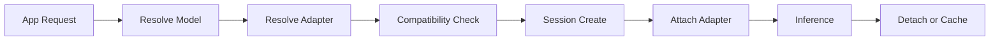

# アプリ別 LoRA / Adapter 戦略

## 目的

ベースモデルを端末上で共有しつつ、アプリごとのカスタマイズを低コストに適用する。

## 基本方針

- ベースモデルは 1 つを共有
- adapter / LoRA はアプリごと namespace で管理
- 適用単位は **セッション単位** を基本とする
- 実運用ではベースモデル + 単一 adapter を推奨

## 管理単位

### Base Model

- `base_model_id`
- `variant_id`
- `quantization`
- `runtime_compat`

### Adapter Package

- `adapter_id`
- `owner_app_id`
- `base_model_compat`
- `quantization_compat`
- `task_profile`
- `signature`
- `sha256`

## 適用フロー

## 運用ルール

- adapter は署名済み package のみ許可
- base model と量子化互換がある場合のみ attach
- セッション中の adapter 切替は制限付き
- RAM 上限を超える adapter は利用不可

## 開発者向けフロー

1. 学習済み adapter を登録
2. サーバー側で manifest と署名を発行
3. 端末が互換性を確認
4. adapter をダウンロード
5. セッション開始時に attach
6. 終了時に detach、必要に応じて warm cache 保持

## 将来拡張

- 複数 adapter の重ね掛け
- 個人化 adapter のローカル生成
- adapter 品質プロファイルの自動選択