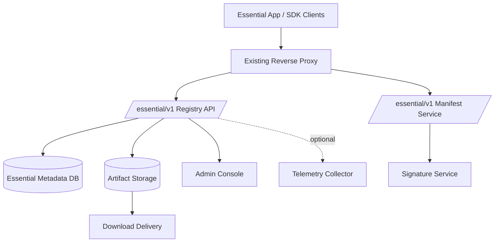

# サーバー側アーキテクチャ

## 前提

- 配信サーバーは `210.131.210.210:2222`
- 他アプリが既に稼働している
- 既存環境を壊さないことが最優先

## 基本方針

- 既存環境へ大規模変更を加えない
- Essential 用機能は **独立サービス群** として追加する
- 役割を Control Plane、Artifact Plane、Telemetry Plane に分離する

## 構成図

## Plane ごとの責務

### Control Plane

- モデル登録
- adapter 登録
- manifest 発行
- 互換性情報配信
- クライアントポリシー配信

### Artifact Plane

- モデル本体配信
- adapter 配信
- Range Request 対応
- 大容量配信最適化

### Telemetry Plane

- 任意参加の匿名分析
- ダウンロード失敗率把握
- 端末互換性分析

## 非破壊導入戦略

- 既存アプリの DB と分離
- 既存プロセスと分離
- 既存ログと分離
- URL パス単位で限定的に追加
- 可能なら artifact は外部オブジェクトストレージへ分離

## 推奨 API

- `GET /essential/v1/catalog`
- `GET /essential/v1/models/{id}/manifest`
- `GET /essential/v1/models/{id}/download`
- `GET /essential/v1/adapters/{id}/manifest`
- `POST /essential/v1/admin/models`

## セキュリティ

- manifest 署名
- artifact hash 配布
- 管理 API と配信 API の権限分離
- 監査ログの分離保存

## 運用上の注意

- 大容量配信は既存業務系トラフィックと帯域を競合させない
- レジストリ API は軽量、artifact 配信は独立最適化
- サーバー負荷よりクライアントの整合性検証を重視する