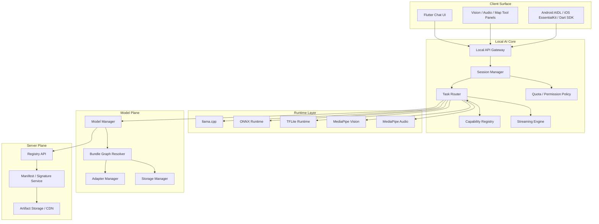
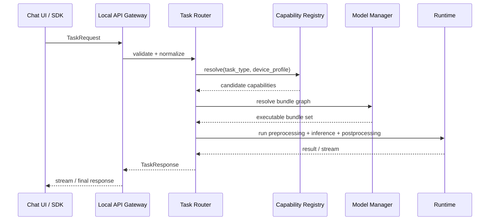

# マルチモーダル統合アーキテクチャ概要

## 目的

Google AI Edge Gallery で実証されたマルチモーダル体験を、`Essential` の既存アーキテクチャへ全面統合する。既存のテキスト中心構成を壊さず、画像、音声、位置情報を同一のローカル推論基盤、SDK、モデル配信基盤、チャット UI に接続する。

本章では以下を定義する。

- タスク種別を起点に推論経路を選択する `Task Router`
- ランタイムとモデル能力を宣言的に管理する `Capability Registry`
- 既存アーキテクチャとの統合ポイント
- マルチモーダル対応タスクの全体像

## 基本方針

- 既存の `Inference Router` は責務を拡張し、`Task Router` として再定義する
- ルーティング判定はモデル ID 固定ではなく `task_type` + `capability` + `device profile` で行う
- SDK は後方互換を維持しつつ、`GenerateRequest` を包含する `TaskRequest` へ拡張する
- モデル管理は単一モデル管理から `Bundle Graph` 管理へ進化させる
- adapter / LoRA はテキスト専用前提をやめ、モーダリティ互換メタデータに基づいて安全に適用する
- UI は既存チャット体験を中核に据え、ツール面で画像、音声、地図を追加する

## 既存アーキテクチャとの統合

`00_overview.md` と `02_runtime_architecture.md` の構成は維持しつつ、`Inference Router` をマルチモーダル対応へ拡張する。



## Task Router 設計

## 役割

`Task Router` は、`04_ipc_and_sdk.md` で定義済みの共通入口から受けた要求を、タスク種別ごとに最適なランタイムとモデルバンドルへ解決するコンポーネントである。

既存の `Inference Router` との差分は次のとおり。

- 入力を `messages / input` から `typed payload` へ拡張
- ランタイム選択を `model runtime` 中心から `task semantics` 中心へ変更
- 単一モデルロードではなく `bundle dependency` 解決を前提にする
- 前処理 / 後処理パイプラインをルーティング対象に含める

## ルーティング入力

```text
TaskRoutingInput
- request_id
- task_type
- typed_payload
- model_requirement
- adapter_requirement
- device_profile
- permission_context
- realtime_hint
- stream
- timeout_ms
```

## ルーティング出力

```text
TaskExecutionPlan
- resolved_task_profile
- selected_runtime
- selected_bundle_ids
- selected_adapter_ids
- preprocessing_steps
- postprocessing_steps
- streaming_mode
- fallback_chain
- telemetry_labels
```

## ルーティングロジック

1. `task_type` から候補 capability を引く
2. `Capability Registry` から実行可能 runtime を取得する
3. 端末の `RAM / NPU / GPU / microphone / camera / location permission` を照合する
4. `Bundle Graph` から必要な `base + encoder + projector + adapter` を解決する
5. リアルタイム要件がある場合は MediaPipe 優先、生成品質重視なら LLM / ONNX を優先する
6. 実行不可なら fallback chain を返し、UI / SDK に代替案を提示する

## Capability Registry 設計

## 役割

`Capability Registry` は、タスクを実行できるランタイム、モデル、前処理器、後処理器を宣言的に登録するメタデータレイヤである。`03_model_management.md` のモデルカタログを補強し、`runtime` 単位ではなく `capability` 単位で検索できるようにする。

## 登録単位

```text
CapabilityDescriptor
- capability_id
- supported_task_types
- runtime_family
- input_modalities
- output_modalities
- model_bundle_requirements
- preprocessing_profile
- postprocessing_profile
- realtime_supported
- streaming_supported
- adapter_supported
- min_os_version
- min_ram_mb
- accelerator_requirements
- permission_requirements
- quality_tier
```

## 代表登録例

| capability_id | task_type | runtime_family | bundle | 用途 |
|---|---|---|---|---|
| `llm.text.chat` | `TEXT_GENERATION` | `llama.cpp` | base + optional adapter | 既存チャット |
| `vision.classification.mp` | `IMAGE_CLASSIFICATION` | `MediaPipe Vision` | vision encoder | 高速画像分類 |
| `vision.ocr.onnx` | `OCR` | `ONNX Runtime` | OCR encoder + decoder | 高精度 OCR |
| `vision.caption.llm` | `IMAGE_CAPTION` | `llama.cpp` | base + vision encoder + projector | 画像説明生成 |
| `audio.stt.android_speech_recognizer` | `STT` | `Android SpeechRecognizer` | system on-device recognizer | ライブ音声認識 |
| `audio.tts.melotts` | `TTS` | `MeloTTS` | MeloTTS Android export | 読み上げ |
| `audio.command.mp` | `VOICE_COMMAND` | `MediaPipe Audio` | audio classifier | 低遅延コマンド |
| `location.context.llm` | `LOCATION_CONTEXT` | `llama.cpp` | base + location preprocessor | 位置文脈会話 |

## タスク種別定義

Essential が標準対応する `task_type` は以下とする。

| task_type | 入力 | 出力 | 第一候補ランタイム |
|---|---|---|---|
| `TEXT_GENERATION` | text | text | `llama.cpp` |
| `IMAGE_CLASSIFICATION` | image | labels | `MediaPipe Vision` / `ONNX Runtime` |
| `OBJECT_DETECTION` | image | boxes + labels | `MediaPipe Vision` / `ONNX Runtime` |
| `IMAGE_SEGMENTATION` | image | mask | `MediaPipe Vision` / `ONNX Runtime` |
| `OCR` | image | text + regions | `ONNX Runtime` |
| `FACE_DETECTION` | image | face boxes + landmarks | `MediaPipe Vision` |
| `IMAGE_CAPTION` | image + optional text | text | `llama.cpp` + vision encoder |
| `MULTIMODAL_CHAT` | image/audio/location + text | text | `llama.cpp` + modality encoder |
| `STT` | live audio | text | `Android SpeechRecognizer` |
| `TTS` | text | audio | `MeloTTS` / Android TTS fallback |
| `VOICE_COMMAND` | audio | intent | `MediaPipe Audio` |
| `AUDIO_CLASSIFICATION` | audio | labels | `MediaPipe Audio` / `ONNX Runtime` |
| `SPEAKER_RECOGNITION` | audio | speaker id / embedding | `ONNX Runtime` |
| `LOCATION_CONTEXT` | location + text | text | `llama.cpp` |
| `MAP_REASONING` | location + route / POI graph | text + structured hints | `llama.cpp` + geospatial engine |

## ランタイム登録方針

- `llama.cpp`: テキスト生成、一部マルチモーダル LLM
- `Android SpeechRecognizer`: 端末内ライブ音声認識
- `MeloTTS`: 読み上げモデルファミリー
- `ONNX Runtime`: OCR、画像 / 音声分類、高精度補助モデル
- `TFLite`: 既存軽量モデル互換、Android 既存資産取り込み
- `MediaPipe Vision`: カメラ連動の分類、検出、顔検出、セグメンテーション
- `MediaPipe Audio`: ストリーミング音声前処理、音声コマンド検出

## 実行ポリシー

- リアルタイム UI が必要なタスクは `MediaPipe` 優先
- 認識結果の最終自然言語化は必要に応じて `llama.cpp` に委譲
- 精度重視 OCR は `ONNX Runtime`、読み上げは `MeloTTS` を優先
- モデル未導入時は `Model Manager` と連携して不足 bundle を提示する
- 許可がないモーダリティは事前に fail fast する

## 統合シーケンス



## 他章との関係

- `11_image_vision.md`: 画像系 capability と Vision pipeline の詳細
- `12_audio_speech.md`: 音声系 capability とストリーミング設計の詳細
- `13_map_location.md`: 位置情報系 capability と地図体験の詳細
- `14_sdk_multimodal.md`: `TaskRequest` と各 SDK API 拡張
- `15_model_bundle.md`: `Bundle Graph` と互換性解決

## フェーズ適用

`09_delivery_phases.md` を拡張し、マルチモーダル統合は次の順で導入する。

1. `MULTIMODAL_CHAT` の器を SDK / UI / Router に追加
2. 画像系タスクを先行投入
3. 音声系タスクをリアルタイム基盤込みで投入
4. 位置コンテキスト連携を投入
5. 拡張フェーズで地理空間推論と高度な POI 分析へ進む
