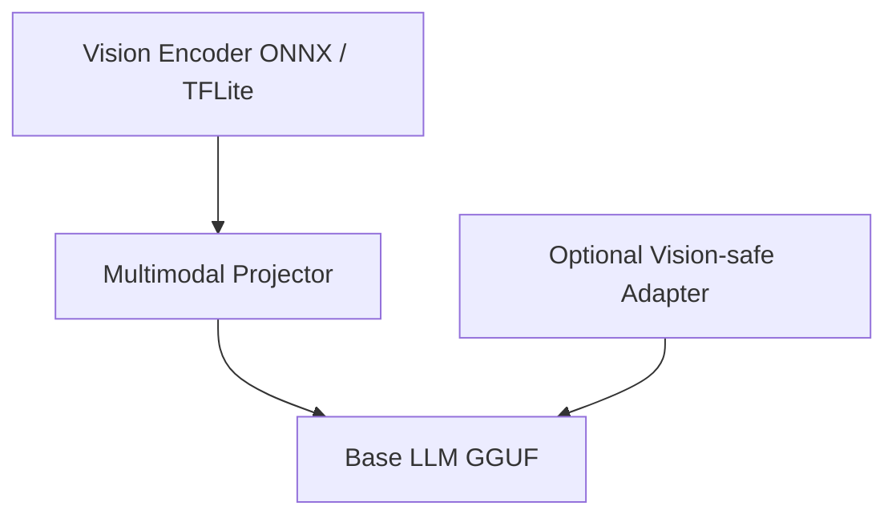

# 画像 / Vision AI 詳細設計

## 目的

写真、カメラ入力、スクリーンショットを `Essential` のチャット体験とツール面へ統合し、認識系タスクと画像理解系タスクの両方をオンデバイスで提供する。

本章の対象タスクは以下とする。

- 画像分類
- 物体検出
- セグメンテーション
- OCR / テキスト認識
- キャプション生成
- 顔検出

## ランタイム構成

| タスク | 第一候補 | 第二候補 | 補足 |
|---|---|---|---|
| 画像分類 | `MediaPipe Vision` | `ONNX Runtime` | カメラ連動時は MediaPipe 優先 |
| 物体検出 | `MediaPipe Vision` | `ONNX Runtime` | バウンディングボックスを標準化 |
| セグメンテーション | `MediaPipe Vision` | `ONNX Runtime` | マスクの圧縮転送に対応 |
| OCR | `ONNX Runtime` | `MediaPipe Vision` | テキスト行・領域情報を保持 |
| 顔検出 | `MediaPipe Vision` | `ONNX Runtime` | ランドマークは任意出力 |
| キャプション生成 | `llama.cpp` + vision encoder | `ONNX encoder + llama.cpp` | 画像埋め込みを projector 経由で LLM へ入力 |

## パイプライン設計

すべての Vision タスクは `preprocess -> infer -> postprocess -> optional LLM synthesis` の 4 段を基本形とする。

```mermaid
flowchart LR
  Input[Camera / Gallery / Shared Image] --> Normalize[Decode / Orientation / Resize]
  Normalize --> Preprocess[Task-specific Preprocess]
  Preprocess --> Runtime[MediaPipe Vision or ONNX Runtime]
  Runtime --> Postprocess[Boxes / Labels / Masks / Text Regions]
  Postprocess --> Struct[Structured Vision Result]
  Struct --> Chat[Optional LLM Synthesis]
  Chat --> UI[Chat Bubble / Overlay / Tool Result]
```



## 前処理

### 共通

- EXIF を考慮した向き補正
- RGB / YUV 変換の標準化
- 短辺基準のリサイズ
- カメラ入力時のフレーム間スロットリング
- 個人情報保護のためのローカルメモリ内処理

### タスク別

- 分類: center crop または aspect-preserving resize
- 検出: letterbox + scale metadata 保存
- セグメンテーション: mask 解像度に応じた downsample
- OCR: コントラスト補正、二値化、傾き補正
- キャプション: vision encoder 入力サイズへ正規化

## 後処理

### 分類

- 上位 N ラベル
- 閾値未満時は `uncertain` を返す
- ローカライズ用ラベル ID を保持

### 物体検出

- NMS 実行
- UI 座標系への再射影
- `box + label + score` を共通形式で返す

### セグメンテーション

- mask 圧縮
- プレビュー用 PNG mask 生成
- overlay 色パレットを UI テーマへ合わせる

### OCR

- block / line / token 階層で返却
- 読み順推定
- 信頼度付きテキスト抽出

### キャプション生成

- vision encoder 出力を projector で LLM 埋め込みへ変換
- システムプロンプトで説明粒度を制御
- OCR 結果や検出結果を補助コンテキストとして同時投入可能

## 結果データ構造

```text
VisionResult
- request_id
- task_type
- image_metadata
- detections[]
- classifications[]
- segments[]
- text_blocks[]
- face_regions[]
- caption_text?
- latency_ms
- model_bundle_used[]
```

## カメラ入力統合

## UI 方針

`06_chat_ui.md` の既存チャット導線を維持し、入力欄左のツール起点から `カメラ` と `写真` を提供する。

- チャット入力欄に `＋` ボタンを追加
- `カメラで撮る` と `ライブラリから選ぶ` をモーダル表示
- 画像添付後はチャットスレッド内にサムネイルカードを配置
- 推論中は画像上の progress overlay とチャット中の status pill を同期表示

## カメラモード

- リアルタイム検出系タスクはプレビュー上に box / mask / face overlay を描画
- キャプション生成や OCR 要約は静止画確定後に実行する
- 高負荷時は FPS を下げ、検出周期を間引く

## ギャラリー選択

- 単画像を標準
- 将来の複数画像入力に備えて payload は配列対応
- 元画像保存は行わず、ユーザー同意がない限りキャッシュ寿命を短くする

## マルチモーダル LLM 対応

`MULTIMODAL_CHAT` では画像とテキスト質問を同時に受ける。

### 入力例

```text
- image: receipt.jpg
- text: このレシートの合計金額と店舗名を教えて
```

### 実行手順

1. `Task Router` が `MULTIMODAL_CHAT` を判定
2. `Bundle Graph` から `base LLM + vision encoder + projector` を解決
3. 画像を vision encoder で埋め込み化
4. テキストプロンプトと結合して `llama.cpp` へ送る
5. 必要に応じて OCR 補助結果を side-channel context として追加する

## Bundle 依存関係



## セキュリティ / プライバシー

- 画像はデフォルトで端末外送信しない
- 顔検出結果はセッション終了後に破棄する
- OCR 結果は監査ログへ全文保存しない
- 共有シートから渡された画像 URI は read-once キャッシュへ変換する

## エラーとフォールバック

| 条件 | 挙動 |
|---|---|
| カメラ権限なし | ギャラリー選択へ誘導 |
| 高負荷でリアルタイム不可 | 静止画解析モードへ自動移行 |
| vision encoder 未導入 | 分類 / OCR の単機能モードを提示 |
| OCR モデル未導入 | 画像説明のみ実行可能と返す |

## 実装メモ

- Android は `CameraX` 経由、iOS は `AVFoundation` 経由でフレーム取得
- Flutter 側は Platform View / texture を使いプレビューを統一する
- Overlay 描画は Dart 側、重い前処理は native 側に置く
- OCR と caption を同時実行する場合は、先に OCR を完了させて LLM 補助文脈へ渡す