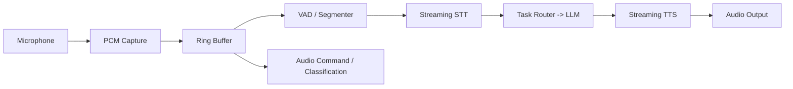
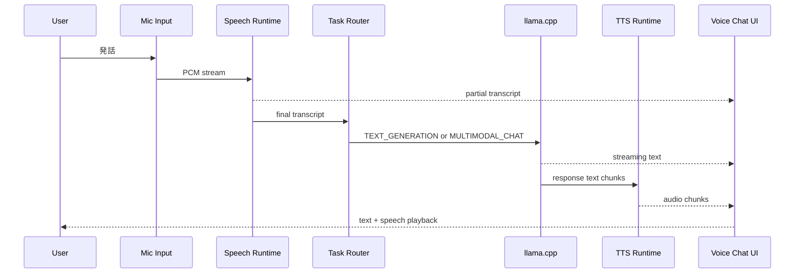

# オーディオ / 音声 AI 詳細設計

## 目的

音声入力を `Essential` のチャット体験へ統合し、対話、音声コマンド、音声認識、音声分類をオンデバイスで提供する。テキスト中心設計を壊さず、`STT -> LLM -> TTS` の往復フローを共通タスク基盤で扱う。

対象タスクは以下とする。

- STT
- TTS
- 音声コマンド認識
- 音声分類
- 話者認識

## ランタイム構成

| タスク | 第一候補 | 第二候補 | 補足 |
|---|---|---|---|
| STT | Android `SpeechRecognizer` | provided transcript | ライブ音声入力を端末内APIで処理 |
| TTS | `MeloTTS` | platform TTS bridge | MeloTTSアセット未導入時のみ互換再生へ切替 |
| 音声コマンド認識 | `MediaPipe Audio` | `ONNX Runtime` | 低遅延優先 |
| 音声分類 | `MediaPipe Audio` | `ONNX Runtime` | 環境音 / イベント検知 |
| 話者認識 | `ONNX Runtime` | - | embedding 抽出中心 |

## ストリーミング設計

音声タスクはフレーム単位での入力を基本とし、`Task Router` は `realtime_hint=true` を優先判断材料とする。



## 入力処理

### 共通

- 16kHz mono PCM を内部標準とする
- native 側で ring buffer を保持し、Flutter 側は制御イベントのみ扱う
- VAD で発話区間を抽出し、無音区間で chunk を確定する
- エコー低減、ノイズ抑制は OS 提供機能を優先利用する

### リアルタイム chunking

- 20ms から 40ms を基本フレームとする
- STT には 0.5 秒から 2 秒の segment を可変長で送る
- 音声コマンドは短窓推論を優先し、部分結果を低遅延で返す

## STT 設計

### 実行フロー

1. マイク入力を PCM で取得
2. VAD で発話区間を切る
3. Android `SpeechRecognizer` でライブ transcription
4. 部分字幕を `Streaming Engine` へ送る
5. 発話終了時に final transcript を確定する

### 出力構造

```text
SpeechToTextResult
- request_id
- partial_transcripts[]
- final_transcript
- language
- segments[]
- confidence
- latency_ms
```

## TTS 設計

### 方針

- 既定は MeloTTS モデルファミリーを採用し、MeloTTSアセットや再生経路が利用できない場合は platform bridge を fallback とする
- 長文応答は文単位でチャンク分割し、再生と生成を並行させる

### 出力構造

```text
TextToSpeechResult
- request_id
- audio_format
- sample_rate_hz
- chunk_refs[]
- voice_id
- duration_ms
```

## STT -> LLM -> TTS 会話フロー



## 音声コマンド認識

### 用途

- `停止`
- `再送`
- `現在地を共有`
- `写真を説明して`
- `ナビ開始`

### 設計

- `MediaPipe Audio` で wake / intent classifier を常時軽量実行
- コマンド認識はチャット本文と分離した control path として処理する
- 誤認識時の副作用を減らすため、高リスク操作は確認 UI を必須にする

## 音声分類 / 話者認識

- 音声分類は環境音やアラート検知の補助機能としてツール面へ表示する
- 話者認識は会話分離や音声メモ整理の基礎機能とし、本人識別用途には使わない
- 話者 embedding は短期キャッシュし、永続保存は明示同意時のみ許可する

## マイク入力 UI 統合

`06_chat_ui.md` のチャット入力欄にマイクボタンを追加し、押下中録音ではなくトグル式セッションを標準とする。

- 録音開始時に入力欄を waveform 表示へ切替
- 部分字幕を入力欄上にライブ表示
- 応答中は `再生停止` と `テキストのみ表示` を切替可能
- バックグラウンド遷移時は録音を自動停止する

## エラーとフォールバック

| 条件 | 挙動 |
|---|---|
| マイク権限なし | 音声ボタン押下時に権限要求し、拒否時はテキスト入力へ戻す |
| STT モデル未導入 | ボイスチャットの初回開始前に bundle 導入を促す |
| リアルタイム性能不足 | 部分字幕を止め、発話終了後一括変換へ切替 |
| TTS モデル未導入 | テキスト応答のみ返し、再生は OS TTS fallback を提示 |

## プライバシー

- 音声バッファはセッション終了時に消去する
- デバッグログへ raw PCM を出力しない
- 文字起こし全文の保存は明示的な履歴設定に従う
- バックグラウンド録音は実施しない
