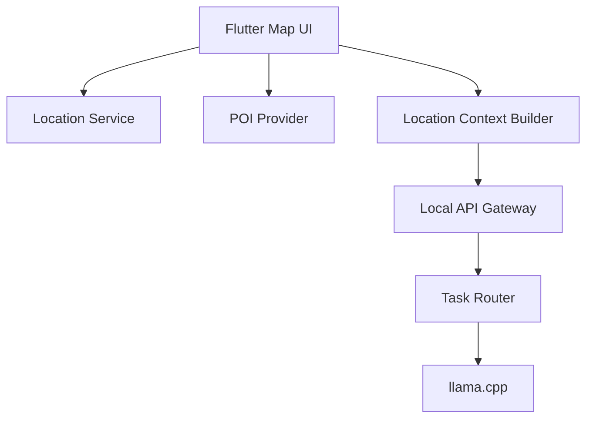
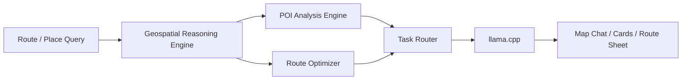

# マップ / 位置情報 AI 設計

## 目的

地図、現在地、周辺 POI を `Essential` の会話体験へ統合し、位置文脈を理解した応答を実現する。初期フェーズでは既存 LLM へ位置コンテキストを安全に供給し、拡張フェーズで地理空間推論へ進む。

## フェーズ定義

## 先行フェーズ

- `Flutter Map` による地図 UI
- 現在地取得
- 周辺 POI 表示
- 選択地点 / 現在地 / 地図範囲を LLM 文脈として供給

## 拡張フェーズ

- 地理空間推論基盤
- POI 分析エンジン
- ルート最適化
- 複数地点比較、移動時間、カテゴリ推定、地理条件考慮

## 先行フェーズ構成



## 位置コンテキスト供給設計

LLM へは raw sensor 値をそのまま渡さず、`Location Context Builder` で構造化してから供給する。

```text
LocationContext
- latitude
- longitude
- accuracy_m
- timestamp
- map_viewport
- selected_poi
- nearby_pois[]
- movement_state
- privacy_level
```

## 文脈生成ルール

- 座標は必要精度に応じて丸める
- POI はカテゴリ、距離、営業時間などの摘要だけを渡す
- 履歴は短時間 window のみ利用する
- ユーザーが共有を明示しない限り、継続追跡は行わない

## LLM への投入例

```text
現在地は東京都内、精度 30m、近くにカフェ 3 件、駅 1 件、コンビニ 2 件があります。
ユーザーは「静かな場所で 30 分作業したい」と質問しています。
```

## 拡張フェーズ設計

## 地理空間推論基盤

拡張フェーズでは `MAP_REASONING` タスクを追加し、地理データを構造化入力として扱う。



### Geospatial Reasoning Engine

- 位置、地図矩形、候補地点集合を正規化
- 距離、移動時間、カテゴリ相性、営業時間を特徴量化
- LLM が扱いやすい summary と structured hints を生成

### POI 分析エンジン

- カテゴリ別ランキング
- 混雑や営業時間、価格帯などの外部属性を将来統合可能
- `quiet_place`, `family_friendly`, `late_open` などの中間タグ生成

### ルート最適化

- 先行は単純な最短 / 最速近傍候補提示
- 拡張で複数目的地巡回、制約付き最適化、移動コスト比較へ対応

## UI 統合

- チャット内で `現在地を使う` ボタンを表示
- 地図タブとチャットタブを別画面に分けず、下部シートで切替可能にする
- POI 選択時はカードと地図ピンを同期ハイライトする
- 位置文脈を使って回答した場合は `位置情報を使用` バッジを明示する

## 権限 / プライバシー設計

位置情報は最も機微性が高いため、`08_risks.md` の安定性優先方針に加えて明示的な privacy controls を設ける。

### 原則

- デフォルトは `都度共有`
- 常時取得は行わない
- LLM へ渡す前に精度丸めを行う
- 履歴保存は opt-in

### プライバシーレベル

| level | 内容 | 用途 |
|---|---|---|
| `approximate` | 市区町村・数百 m 単位 | 周辺提案 |
| `nearby` | 数十 m 単位 | 近隣 POI 提示 |
| `precise` | GPS 生値相当 | ルート開始点、徒歩案内 |

### 保護策

- 位置履歴は短命キャッシュを標準
- ローカルログへ精密座標を残さない
- SDK 呼び出しでは caller ごとに位置利用権限を分離する
- バックグラウンド位置更新は導入しない

## エラーとフォールバック

| 条件 | 挙動 |
|---|---|
| 位置権限なし | 手動地点選択と地名入力へ誘導 |
| GPS 精度不足 | 概略位置での提案へ切替 |
| POI データなし | 位置だけを文脈化し一般回答へフォールバック |
| ルート計算未対応 | 複数候補の説明返答に留める |

## 実装メモ

- Flutter 側は `Flutter Map` を採用し、タイルソース差し替え可能構成にする
- Android / iOS の位置取得は native plugin で抽象化する
- 将来の offline map に備え、POI / route provider をインターフェース化する