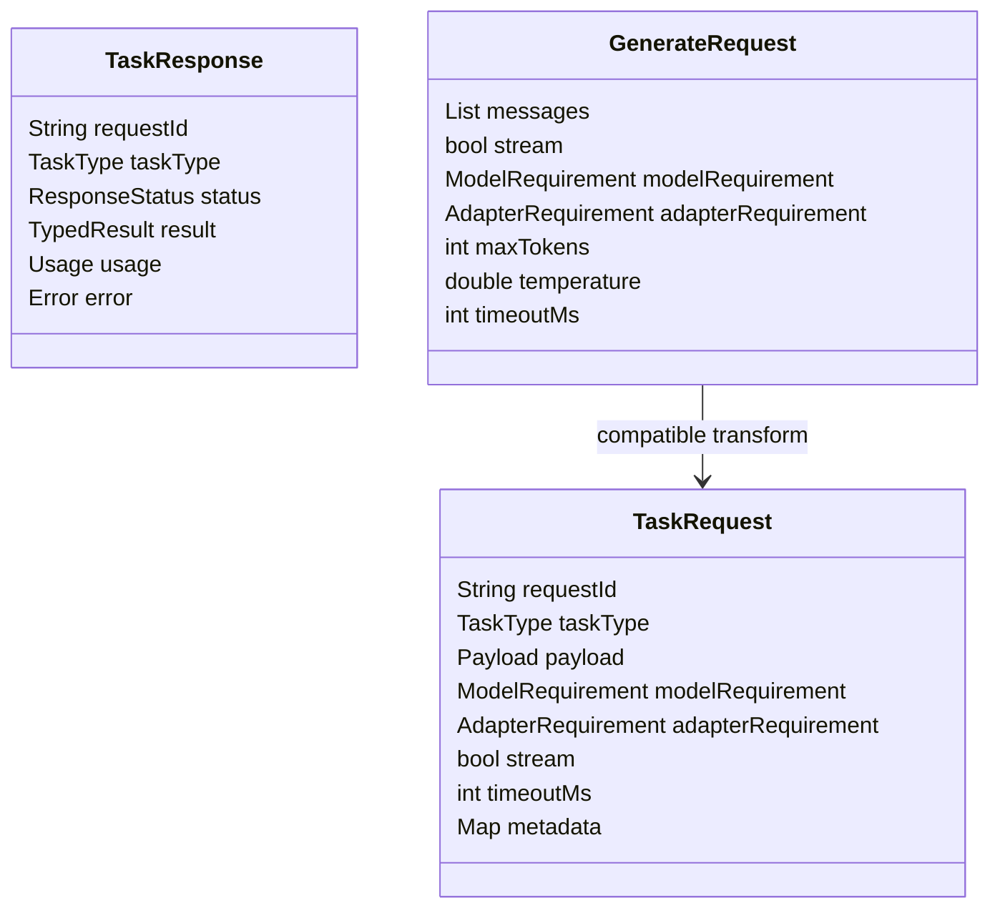

# SDK マルチモーダル拡張設計

## 目的

既存の `GenerateRequest` ベース API を壊さず、画像、音声、位置情報を型安全に扱える `TaskRequest` を導入する。`04_ipc_and_sdk.md` の共通 SDK 方針を継承し、Android、iOS、Dart で同じ概念モデルを提供する。

## 設計原則

- 既存 `GenerateRequest` は非推奨化せず継続利用可能とする
- 新規マルチモーダル機能は `TaskRequest` / `TaskResponse` に集約する
- `GenerateRequest` は内部的に `TaskRequest(taskType=TEXT_GENERATION)` へ変換できるようにする
- ストリーミング、キャンセル、timeout、quota を全タスクで統一する

## 型モデル



## TaskRequest スキーマ

```text
TaskRequest
- request_id
- task_type
- payload
- model_requirement
- adapter_requirement
- stream
- timeout_ms
- caller_context
- privacy_options
- realtime_options
```

## payload 型定義

```text
TextPayload
- messages[]
- system_prompt?
- generation_params

ImagePayload
- images[]
- prompt?
- crop_hints[]
- desired_outputs[]

AudioPayload
- audio_source
- transcript_prompt?
- sample_rate_hz
- language_hint?
- desired_outputs[]

LocationPayload
- coordinate?
- viewport?
- nearby_pois[]
- user_prompt
- privacy_level

MultimodalPayload
- text?
- images[]
- audio?
- location?
- tool_context[]
```

## レスポンス型

```text
TextResult
- text
- chunks[]

VisionResult
- classifications[]
- detections[]
- segments[]
- text_blocks[]
- caption_text?

AudioResult
- transcript?
- audio_chunks[]
- command_intent?
- speaker_profile?

LocationResult
- answer_text
- poi_cards[]
- route_hints[]
```

## 後方互換性

## 互換レイヤ

- `GenerateRequest` はそのまま public API に残す
- SDK 内部で `TaskRequest` へ変換する adapter を持つ
- 旧 API のレスポンスは `TaskResponse.result.text` から復元する
- 既存ストリームコールバックは `TEXT_GENERATION` 用の thin wrapper として維持する

## 互換マッピング

| 旧 API | 新内部表現 |
|---|---|
| `generate(request)` | `runTask(TaskRequest(TEXT_GENERATION))` |
| `generateStream(request)` | `streamTask(TaskRequest(TEXT_GENERATION))` |
| `messages` | `TextPayload.messages` |
| `maxTokens / temperature` | `generation_params` |

## Android API

### AIDL 拡張

```text
runTask(in TaskRequest request)
streamTask(in TaskRequest request, in ITaskCallback callback)
cancel(in String requestId)
listCapabilities()
```

### Kotlin facade

```text
EssentialClient.runTask(request: TaskRequest): TaskResponse
EssentialClient.streamTask(request: TaskRequest): Flow<TaskEvent>
EssentialClient.generate(request: GenerateRequest): GenerateResponse
EssentialClient.generateStream(request: GenerateRequest): Flow<GenerateEvent>
```

## iOS API

### EssentialKit 拡張

```text
EssentialClient.runTask(_ request: TaskRequest) async throws -> TaskResponse
EssentialClient.streamTask(_ request: TaskRequest) -> AsyncThrowingStream<TaskEvent, Error>
EssentialClient.generate(_ request: GenerateRequest) async throws -> GenerateResponse
```

### Swift 型の考え方

- `enum TaskType`
- `enum Payload`
- `struct TaskRequest`
- `struct TaskResponse`
- `struct CapabilityDescriptor`

## Dart API

```text
essential.runTask(TaskRequest request)
essential.streamTask(TaskRequest request)
essential.generate(GenerateRequest request)
essential.generateStream(GenerateRequest request)
```

## SDK イベントモデル

すべてのストリーミング API は共通イベントを返す。

```text
TaskEvent
- started
- partial_result
- progress
- requires_model_download
- completed
- failed
- cancelled
```

## バリデーション

- `task_type` と `payload` の組み合わせ不一致を reject
- モーダリティ権限不足を送信前に検知
- `privacy_options` が caller policy を超える場合は `PERMISSION_DENIED`
- `adapter_requirement` は `task_type` と bundle 互換を満たす場合のみ受理

## エラー拡張

既存エラーに加えて以下を追加する。

- `UNSUPPORTED_TASK_TYPE`
- `PAYLOAD_SCHEMA_INVALID`
- `MODALITY_PERMISSION_DENIED`
- `CAPABILITY_NOT_AVAILABLE`
- `BUNDLE_DEPENDENCY_MISSING`
- `REALTIME_NOT_SUPPORTED`

## 実装移行順

1. 共通 protocol package に `TaskRequest` / `TaskResponse` を追加
2. 既存 `GenerateRequest` を内部変換対応
3. Android / iOS / Dart facade に新 API を追加
4. UI を `runTask` ベースへ段階移行
5. 外部 SDK 利用者には旧 API 維持のまま新機能だけ opt-in 提供