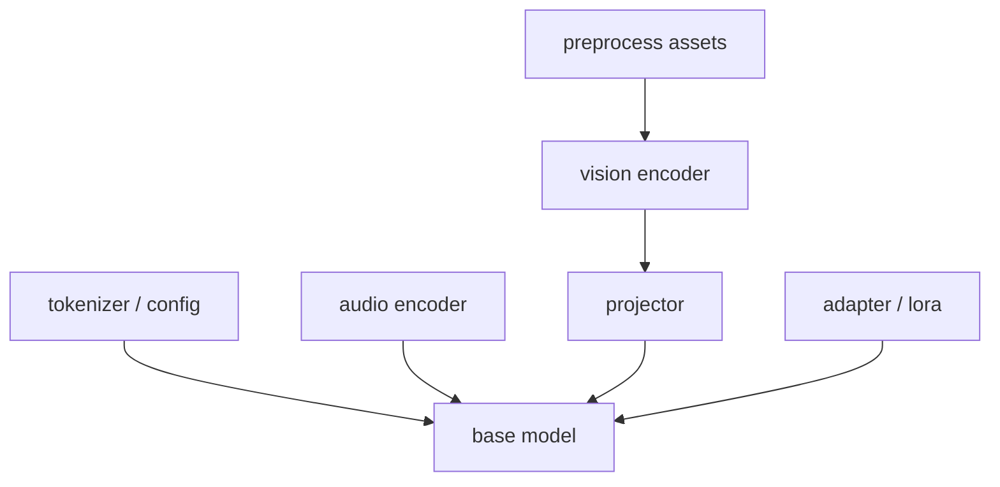

# Bundle Graph モデル管理拡張設計

## 目的

`03_model_management.md` の単体モデル管理を拡張し、マルチモーダル時代に必要な `base + encoder + projector + adapter / LoRA` を一貫して扱う。これにより、画像、音声、位置情報前処理、マルチモーダル LLM の依存解決を安全に実現する。

## Bundle Graph 概念

`Bundle Graph` は、1 つの AI タスクを実行するために必要なアーティファクト群をノードと依存辺で表現する。



## 管理対象ノード

| node_type | 役割 |
|---|---|
| `base` | LLM 本体、TTS 本体 |
| `tokenizer` | tokenizer、config、vocabulary |
| `encoder` | vision encoder、audio encoder、OCR encoder |
| `projector` | multimodal projector |
| `adapter` | LoRA / adapter |
| `asset` | labels、vocabulary、preprocess parameter |

## Bundle Manifest スキーマ

```text
BundleManifest
- bundle_id
- version
- task_profiles[]
- runtime_family
- nodes[]
- edges[]
- compatibility
- download
- integrity
- license
```

```text
BundleNode
- node_id
- node_type
- artifact_id
- runtime_family
- modality
- format
- size_mb
- sha256
- signature
- compatibility_tags[]
```

```text
BundleEdge
- from_node_id
- to_node_id
- relation_type
- required
```

## 互換性情報

```text
compatibility
- supported_task_types[]
- os_constraints
- accelerator_constraints
- min_ram_mb
- quantization
- tokenizer_family
- adapter_support
- modality_support
```

## 依存解決ロジック

`Model Manager` は単一モデルの存在確認ではなく、bundle graph 全体の可解性を判定する。

### 解決手順

1. `task_type` から候補 `bundle_id` 群を取得
2. base node と必須 encoder / projector / asset を展開
3. 端末能力と OS 制約を照合
4. adapter 要求がある場合、base / quantization / modality 互換を検証
5. すべての必須ノードが `active` なら実行可能とする
6. 不足ノードがあればダウンロード計画を返す

### 解決結果

```text
BundleResolution
- executable
- selected_bundle_id
- selected_nodes[]
- missing_nodes[]
- fallback_bundle_id?
- incompatibilities[]
```

## 差分配信

`07_server_architecture.md` の Artifact Plane は bundle graph に対応し、巨大 base を再取得せず差分導入できるようにする。

### 原則

- base node は共有キャッシュする
- encoder / projector / adapter は個別 node として配信する
- manifest 更新時は変更ノードのみ取得する
- partial download の整合性は node 単位で検証する

### 差分配信単位

| 単位 | 例 |
|---|---|
| node 差分 | projector だけ更新 |
| variant 差分 | `q4` から `q5` へ移行 |
| adapter 差分 | 新しい app-specific LoRA 追加 |

## Bundle 互換性検証

### 検証観点

- runtime family 一致
- tokenizer family 一致
- quantization 互換
- modality support 一致
- OS / accelerator 制約
- signature / hash 整合

### 検証タイミング

- catalog 取得時の事前評価
- download 完了後の staging 検証
- session 開始前の最終評価

## Adapter / LoRA モーダリティ対応

`05_adapter_strategy.md` を拡張し、adapter にモーダリティ互換メタデータを持たせる。

```text
AdapterMetadata
- adapter_id
- base_model_compat
- quantization_compat
- supported_task_types[]
- supported_modalities[]
- requires_projector?
- incompatible_encoders[]
- owner_app_id
- signature
```

## 安全判定ルール

- `supported_modalities` に現在タスクのモーダリティが含まれない adapter は attach しない
- `requires_projector=true` の adapter は projector node 不在時に拒否する
- vision / audio encoder と競合する `incompatible_encoders` を持つ場合は attach 不可
- 不可時は base bundle のみで継続可能かを `Task Router` へ返す

## 状態管理

既存状態を bundle node 単位に拡張する。

- `not_installed`
- `downloading`
- `staged`
- `active`
- `failed`
- `obsolete`

bundle 全体の状態は、必須 node の最小状態で評価する。

## 保存戦略

- base node は共有領域へ保存
- app 固有 adapter は namespace 分離
- projector / encoder は family 単位で共有可能にする
- セッション中の node は pin し、LRU 対象から除外する

## 障害時挙動

| 障害 | 対応 |
|---|---|
| projector 欠落 | text-only fallback 候補を返す |
| encoder 不整合 | 同 task_type の代替 bundle を検索 |
| adapter 互換性不一致 | adapter なし継続可否を返す |
| node hash 不一致 | staging 隔離し再取得要求 |

## 実装移行

1. 既存 model catalog に `bundle_id` と node 概念を追加
2. storage manager を node 単位管理へ変更
3. registry / manifest API を bundle graph 対応へ拡張
4. task router と capability registry を bundle resolver に接続
5. UI のモデル管理画面へ依存 bundle 表示を追加
